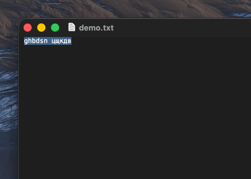
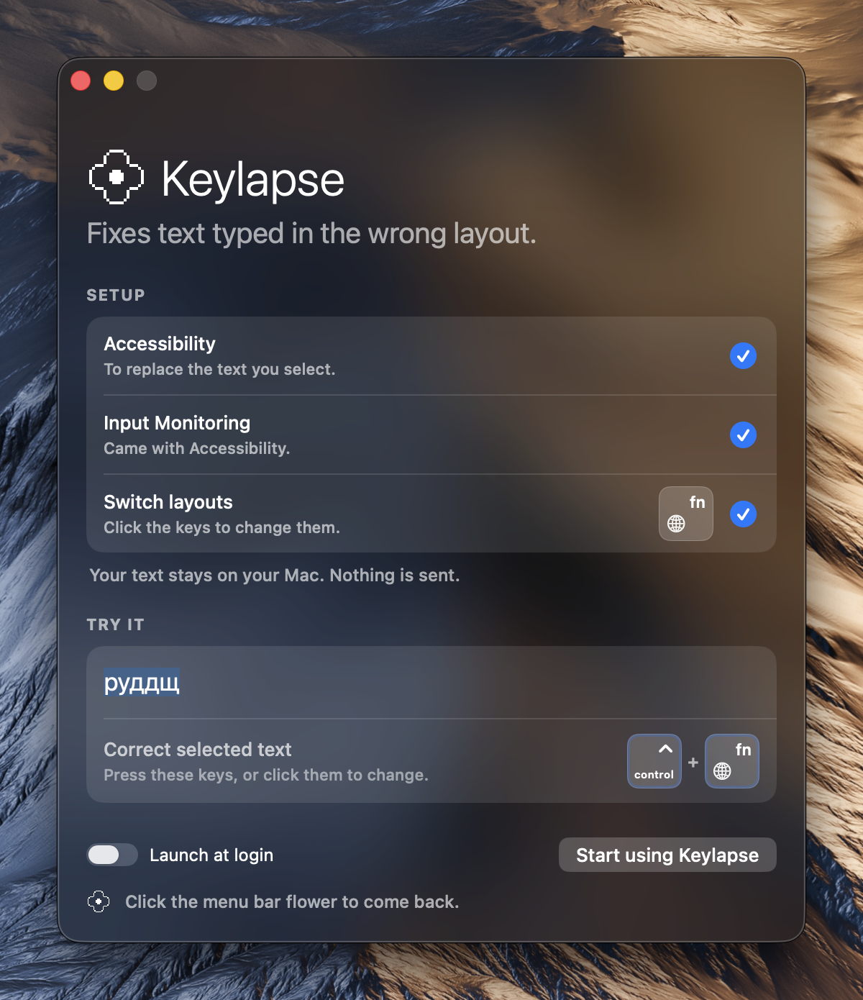
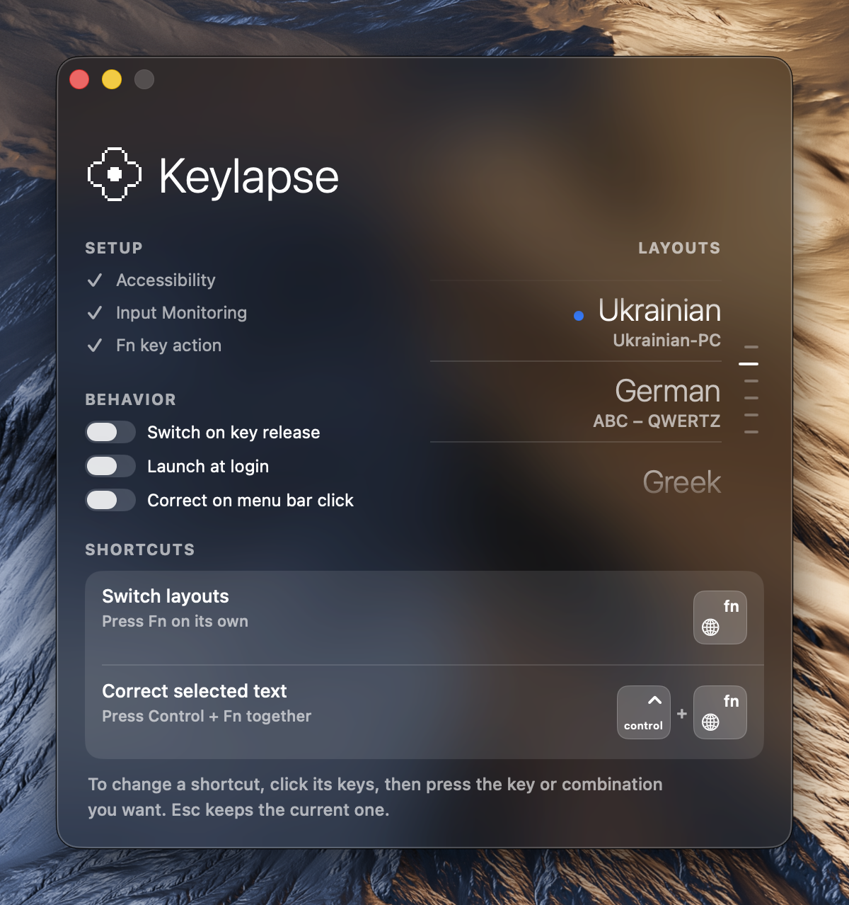
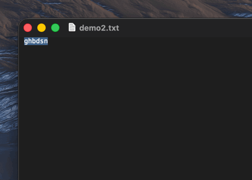

# Keylapse

You type a whole sentence, look up, and it reads `ghbdsn цщкдв`. Wrong layout again. Keylapse is a menu bar app for the Mac that fixes this: select the text, press `Control + Fn`, and it becomes `привіт world`. Both halves, each the right way round. No retyping, no dictionaries, nothing leaves your Mac.

`Fn` on its own switches layouts. Any layout macOS knows is fine. macOS 13 or later.



## Get started

1. Download `Keylapse-<version>.zip` from the [latest release](https://github.com/openchamber/keylapse/releases/latest), unzip it, drop Keylapse into Applications and open it. The welcome window walks you through the rest.

   

2. Click **Grant…** beside Accessibility and allow Keylapse in the macOS settings that open. Input Monitoring usually comes along for free. If its row still asks, grant it too.
3. If Setup asks you to set Fn to **Do Nothing**, click **Open Settings** and choose that in Keyboard settings. Another Fn language switcher running? Quit it, or the two will fight over the key.
4. Under **Try it** the word is already selected. Press `Control + Fn`, watch it turn into `hello`, then click **Start using Keylapse**. The flower in the menu bar brings the window back; the first item in its menu opens it.

Fn is sacred on your Mac? Click **Use other keys** on that step and press what you like, Right Command for instance. If the correction keys have Fn in them too, the same row asks for new ones. Nothing in macOS changes. Any shortcut with Fn in it, alone or with other keys, works only while macOS has Fn set to Do Nothing.

## Everyday use

- **Switch layouts.** Press `Fn`. It cycles through every input source enabled in macOS, input methods included.
- **Fix text.** Select it, hold `Control`, tap `Fn`, let go. Nothing selected, nothing happens.
- **Undo.** `⌘Z` in your editor, like any other edit.

### Shortcuts you choose

Click the drawn keys of a row under **Shortcuts** and press what you want instead. The two shortcuts are independent; the only rule is that they differ.

- Modifier keys on their own: one or several held together and released without any other key. Fn, Right Command, Control-Fn, Control-Option. Fn alone switches the moment you press it. Other modifiers switch when you let go, and a regular key pressed meanwhile cancels the switch, so Option-E still types é.
- A combination: any key with a modifier, Option-Space or Control-Shift-L, or an F-key on its own. Keylapse takes these before the app in front sees them. You can even grab one macOS already uses, Command-Space say; the row tells you what stops working while Keylapse runs.

Left and right are told apart as you recorded them, so Left Command-Space can switch while Right Command-Space corrects. A lone key (F-keys aside) is refused, and so is the same shortcut for both; the keys flash red and the row says why. **Reset** brings back Fn and Control-Fn.



### The rest

With two layouts, correction is instant. With more, a small **Correct to** list asks where. Layout variants, U.S. and Dvorak say, count separately.

The welcome window comes back any time: click the flower, then **Show Welcome Page**.

Keylapse can start at login, and it can correct the selection when you click the flower, in which case the menu opens on right-click. Both live under **Behavior**. Correction goes through the clipboard: what you had copied is put back afterwards, and clipboard managers are asked to look away.

Keylapse keeps itself up to date. It checks GitHub when it starts and once a day after that, and **Check for Updates…** in the flower's menu checks right now. When there is a new version, a window says what changed and offers to install it. Nothing downloads before you agree, and that check is the only thing Keylapse ever sends anywhere. Your text is not in it.

## Languages

Any keyboard layout macOS can describe as a key table works, in any language. Keylapse reads each layout's own letters and maps them by physical key, so there is no list of supported languages to get onto. It needs two such layouts. Input methods that compose text, such as Japanese, Chinese or Korean, are marked **Switching only**: the switch key still reaches them, and text typed on your other layouts is corrected while they are active.

Which layout typed the text is worked out from the letters, word by word. A layout that cannot type one of a word's letters is out. One left, that is it, whatever is active, so you need not switch back first. Several left (plain Latin letters fit English and German alike), and it takes the layout the neighbouring words were typed on, then the active one. When the candidates would give the same result anyway, because those letters sit on the same keys, it just goes ahead. Only when they would differ does Keylapse ask you to switch to the layout you typed on, rather than guess.

Whatever you select is corrected. A sentence typed half on one layout and half on another is swapped word by word, and a word that changes alphabet midway is split there. With more than one way to correct the selection, the **Correct to** list asks; whatever you choose there works. For text from two layouts the first choice swaps them (English ↔ Ukrainian) and each other choice moves the whole text to that layout.



English and Ukrainian are tested end to end. Other languages should work and are waiting for a tester. Letters typed through dead keys cannot always be corrected.

Correction needs an editable field that accepts a paste. Password fields and some editors do not.

## Building from source

Keylapse is a Swift package with no dependencies beyond Sparkle, which it fetches. With Xcode or the Command Line Tools installed:

```sh
bash scripts/test.sh    # unit tests
bash scripts/build.sh   # dist/Keylapse.app, signed with a local certificate (run scripts/setup-local-signing.sh once)
```

`bun kl-dev` (or `node scripts/kl-dev.mjs`) lists the everyday commands; TOOLING.md explains them, and HANDOFF.md and DESIGN.md describe how the app and its window are meant to work.

## License

Keylapse is free software under the GNU General Public License, version 3: see LICENSE. Copyright 2026 Iuliia Ivashko.
